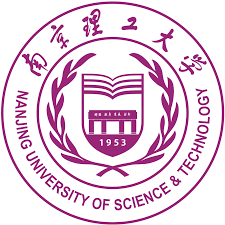

Hi, I am Haoyang, a fourth-year undergraduate student in [the School of Cyberspace Security at Nanjing University of Science and Technology (NJUST)](https://scs.njust.edu.cn/), where I am fortunate to be supervised by [*Prof. Zhichao Lian*](https://gsmis.njust.edu.cn/open/TutorInfo.aspx?dsbh=M3kK3EWHXJc6xzMaFrhOQA==&yxsh=z70ppxVSQAs=&zydm=SwsWR9zpmmw=) and *Dr. Shuangquan Zhang*.😎 Previously, I had a wonderful time at [Tencent](https://www.tencent.com/zh-cn/) mentored by senior expert *Elmer Peng*. Starting September 2025, I will further my studies in [the Department of Computer Science at the University of Hong Kong (HKU)](https://www.cs.hku.hk/), see you in HK!🤪

I am seeking Research Assistant, Intern, or Visiting Student positions available from Feb. to Aug. 2025, as well as PhD or MPhil/MRes opportunities starting in Fall 2026 or Spring/Fall 2027.🥺

Here are my <a href="https://ALIENHHY.github.io/_pages/CV_Haoyang_Hu_NJUST.pdf" target="_blank">[CV-PDF]</a>, <a href="https://ALIENHHY.github.io/_pages/胡皓阳中文学术简历.pdf" target="_blank">[中文简历]</a> and <a href="https://ALIENHHY.github.io/_pages/Transcripts-Haoyang Hu.pdf" target="_blank">[Transcripts]</a>, last updated in January 2025.

Research Interests
---
* **Trustworthy AI:** Particularly focus on the security of LLMs, like jailbreaking attacks.
* **AI for Everything:** Exploring data-driven methods to enhance decision-making processes.
* **Intelligent Robotics:** I have won Gold Award at the VEX Robotics World Championship.

As an undergraduate student, I am still actively exploring and shaping my research interests. My past research experience spans projects in ***machine learning***, ***computer vision***, ***cryptography*** and ***federated learning***, all of which I find deeply fascinating too.

[//]: # (Currently, I am leading a project on ***the security of LLMs***, developing a black-box jailbreaking attack toolkit, which is also my graduation thesis. I am also contributing to a project on ***AI application in the pharmaceutical industry***, which is nearing implementation.)

While I am still in the early stages of gaining a deeper understanding of these fields, I am confident in my abilities and deeply passionate about broadening my expertise.

News
---
*  I received an offer of *MSc. CIE* from CUHKSZ, with a scholarship of RMB 30,000!🤑
*  I accepted the offer from HKU, thanks to everyone!😘 **See you in Hong Kong!**🤗
*  I received an offer of *MSc. CS* from HKU!🤤
*  I completed my internship at Tencent, thanks to my mentor, thanks to everyone!
*  I presented our work at the CyberSciTech 2024 conference!
*  I received an offer of *MSc. Cyber Security* from the University of Edinburgh!🥰
*  I received my first offer for *MSc. Robotics* from the University of Bristol!😍
*  Our work about ***"IDS"*** was accepted by the CyberSciTech 2024 conference!
*  I started my internship at *ESG Coordination Office (ECO Lab)*, Tencent!😊
*  My work about ***"Smart Guide Cane"*** was granted as an invention patent!

Experiences
---
*  Co-founder, Nanjing Nebulorix Co., Ltd.
*  Intern, *ESG Coordination Office (ECO Lab)*, Tencent <a href="https://alienhhy.github.io/internships/" target="_blank">[Link]</a>
*  Intern, *Cloud Network Maintenance Center*, China Telecom
*  Intern, *Judicial Appraisal Institute*, CINGHOO
*  Intern, *DarkArmor Lab*, MoreSec

---

